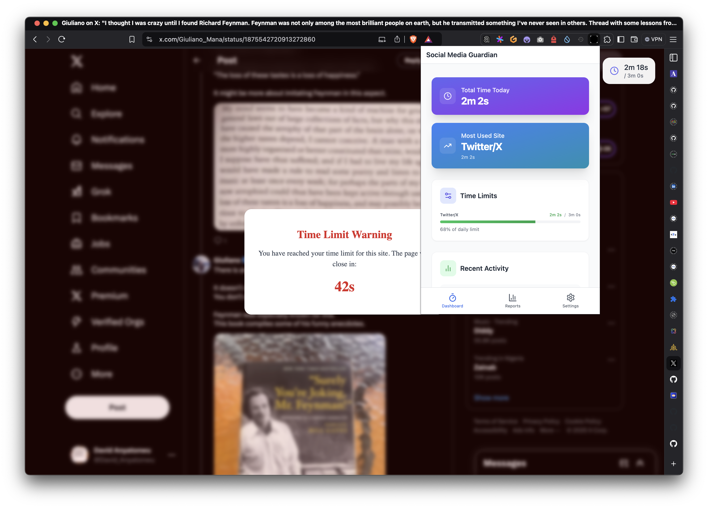

# Social Media Time Tracker

[](https://opensource.org/licenses/MIT)
[](http://makeapullrequest.com)
[](https://github.com/yourusername/social-time-guardian/graphs/commit-activity)



The Social Media Guardian helps you manage your social media usage by tracking time spent and providing time limit warnings. The interface shows:
- Total time tracking
- Most used site statistics
- Time limit warnings when you exceed your set boundaries
- Usage progress visualization

A powerful browser extension to help you manage and limit your time on social media platforms.

## Table of Contents
- [Features](#features)
- [Prerequisites](#prerequisites)
- [Installation](#installation)
- [Usage](#usage)
- [Development](#development)
- [Automated Builds](#automated-builds)
- [Packaging](#packaging)
- [Privacy & Security](#privacy--security)
- [Troubleshooting](#troubleshooting)
- [Contributing](#contributing)
- [Versioning](#versioning)
- [Authors](#authors)
- [License](#license)
- [Acknowledgments](#acknowledgments)

## Prerequisites
- Node.js (v14 or higher)
- npm (v6 or higher)
- Chrome/Firefox/Edge browser (latest version)
- Basic knowledge of browser extensions for development

## Features

### Time Tracking
- **Real-time Tracking**: Automatically tracks time spent on social media sites
- **Persistent Tracking**: Continues tracking across browser sessions
- **Multiple Platform Support**: Works with:
  - Twitter/X (x.com)
  - Facebook (facebook.com)
  - Instagram (instagram.com)
  - TikTok (tiktok.com)
  - LinkedIn (linkedin.com)

### Time Limits
- **Daily Limits**: Set custom daily time limits for each platform
- **Weekly Limits**: Set weekly time limits independent of daily limits
- **Flexible Management**: Add, remove, or modify limits at any time
- **Visual Progress**: See your usage progress with color-coded indicators
  - Green: Below 75% of limit
  - Yellow: Between 75-90% of limit
  - Red: Above 90% of limit

### Notifications & Warnings
- **Approaching Limit**: Get notified when nearing your time limit
- **Customizable Threshold**: Set when you want to be notified (50-90% of limit)
- **Visual Warnings**: Progressive UI changes as you approach limits
- **Final Warning**: Full-screen overlay with countdown when time is up
- **Blur Effect**: Screen gradually blurs in the final 10 seconds

### Dashboard
- **Total Time Today**: See aggregate time across all platforms
- **Most Used Site**: Quickly identify your most-used platform
- **Sites Near Limit**: Track which sites are approaching limits
- **Usage Breakdown**: Detailed view of time spent per platform
- **Progress Bars**: Visual representation of usage vs limits

### Reports
- **Time Frames**: View usage data by:
  - Daily
  - Weekly
  - Monthly
- **Usage Breakdown**: Detailed charts and statistics
- **Historical Data**: Track your usage patterns over time
- **Comparative Analysis**: Compare usage across platforms

### Settings
- **Time Management**:
  - Set custom time limits per site
  - View and edit current day's usage
  - Reset time counters when needed
  - Manually adjust tracked time
- **Notification Controls**:
  - Enable/disable notifications
  - Set custom warning thresholds
  - Configure notification timing

## Technical Details

### Storage
- Time data is stored in seconds for precision
- Data persists across browser sessions
- Daily reset at midnight
- Separate tracking for:
  - Daily usage
  - Weekly usage
  - Time limits
  - Notification settings

### Time Calculations
- Real-time tracking with second precision
- Automatic conversion between display units:
  - Shows hours (h) when applicable
  - Shows minutes (m) for medium durations
  - Shows seconds (s) for short durations
- Handles time zones and date boundaries

### State Management
- **Timeout State**: Persists across page reloads
- **Warning State**: Prevents navigation when active
- **Sync State**: Real-time updates across tabs

## Usage

### Installation
1. Clone the repository
2. Install dependencies: `npm install`
3. Build the extension: `npm run build`
4. Load the extension in your browser:
   - Chrome: Open chrome://extensions
   - Enable Developer Mode
   - Click "Load unpacked"
   - Select the `dist` directory

### Setting Up Time Limits
1. Open the extension settings
2. Click "Add New Limit"
3. Enter the website domain (e.g., "x.com")
4. Set your desired daily limit in minutes
5. Click "Add" to save the limit

### Managing Time
- **Reset Time**: Click the reset icon next to any site's usage
- **Edit Time**: Click the edit icon to manually adjust tracked time
- **Remove Limit**: Click the trash icon to remove a time limit
- **Save Changes**: Click "Save Changes" after making modifications

### Notifications
1. Enable notifications in the settings
2. Set your preferred warning threshold (50-90%)
3. Receive alerts when:
   - Approaching your time limit
   - Reaching your time limit
   - Time limit exceeded

## Development

### Project Structure
```
src/
├── background/     # Background scripts
├── components/     # React components
├── content/       # Content scripts
├── services/      # Core services
├── types/         # TypeScript definitions
└── utils/         # Utility functions
```

### Key Components
- **Worker**: Handles time tracking and limit enforcement
- **Dashboard**: Shows usage statistics and limits
- **Settings**: Manages time limits and preferences
- **Reports**: Generates usage reports and analytics

### Building
```bash
# Development build
npm run dev

# Production build
npm run build

# Run tests
npm test
```

## Automated Builds

### Latest Release
For non-developers, you can download the latest version directly from our [Releases page](https://github.com/onyedikachi-david/social-time-guardian/releases). Each release includes:
- Chrome/Edge extension (`.zip`)
- Firefox add-on (`.xpi`)
- Release notes and changelog

### Automated CI/CD
We use GitHub Actions to automatically:
- Build the extension for all supported browsers
- Run tests and quality checks
- Create release packages
- Deploy to browser stores (pending manual review)

The automated process ensures:
- Consistent build quality
- Pre-release testing
- Automated versioning
- Easy installation for non-developers

### Installation from Release
1. Download the appropriate file for your browser:
   - Chrome/Edge: `social-media-guardian.zip`
   - Firefox: `social-media-guardian.xpi`

2. Installation steps:
   **Chrome/Edge:**
   - Extract the downloaded ZIP file
   - Go to extensions page (`chrome://extensions` or `edge://extensions`)
   - Enable "Developer mode"
   - Click "Load unpacked"
   - Select the extracted folder

   **Firefox:**
   - Open Firefox
   - Drag and drop the `.xpi` file into Firefox
   - Click "Add" when prompted

## Packaging

### For Chrome Web Store
1. Build the production version:
```bash
npm run build
```

2. Create a ZIP file of the `dist` directory:
```bash
cd dist && zip -r ../social-media-guardian.zip . && cd ..
```

3. Submit to Chrome Web Store:
   - Go to [Chrome Developer Dashboard](https://chrome.google.com/webstore/devconsole)
   - Click 'New Item'
   - Upload the `social-media-guardian.zip` file
   - Fill in extension details:
     - Description
     - Screenshots
     - Privacy policy
     - Store listing details
   - Submit for review

### For Firefox Add-ons
1. Build the production version:
```bash
npm run build:firefox
```

2. Create a ZIP file:
```bash
cd dist && zip -r ../social-media-guardian-firefox.zip . && cd ..
```

3. Submit to Firefox Add-ons:
   - Visit [Firefox Add-on Developer Hub](https://addons.mozilla.org/developers/)
   - Click 'Submit a New Add-on'
   - Upload the `social-media-guardian-firefox.zip` file
   - Complete submission details
   - Submit for review

### For Edge Add-ons
1. Build the production version:
```bash
npm run build
```

2. Create a ZIP file:
```bash
cd dist && zip -r ../social-media-guardian-edge.zip . && cd ..
```

3. Submit to Edge Add-ons:
   - Go to [Edge Add-ons](https://partner.microsoft.com/dashboard/microsoftedge/overview)
   - Click 'Submit new extension'
   - Upload the `social-media-guardian-edge.zip` file
   - Fill in required information
   - Submit for review

### Local Installation
For development or personal use, you can load the unpacked extension:

**Chrome/Edge:**
1. Go to extensions page (`chrome://extensions` or `edge://extensions`)
2. Enable "Developer mode"
3. Click "Load unpacked"
4. Select the `dist` directory

**Firefox:**
1. Go to `about:debugging`
2. Click "This Firefox"
3. Click "Load Temporary Add-on"
4. Select any file from the `dist` directory

## Privacy & Security
- All data is stored locally in your browser
- No data is sent to external servers
- Time tracking only occurs on specified domains
- Extension permissions are limited to required domains

## Contributing
Contributions are welcome! Please read our contributing guidelines before submitting pull requests.

## License
This project is licensed under the MIT License - see the LICENSE file for details.

## Troubleshooting

### Common Issues
1. **Extension Not Loading**
   - Verify that developer mode is enabled
   - Check console for error messages
   - Try removing and re-loading the extension

2. **Time Not Tracking**
   - Ensure permissions are granted for target websites
   - Check if site is in the supported domains list
   - Verify browser's background script permissions

3. **Settings Not Saving**
   - Clear extension storage and try again
   - Check browser permissions for storage access
   - Verify no conflicts with other extensions

### Debug Mode
Enable debug mode in the extension settings to get detailed logs for troubleshooting:
1. Right-click the extension icon
2. Select "Debug Mode"
3. Open browser console to view logs

## Versioning
We use [SemVer](http://semver.org/) for versioning. For available versions, see the [tags on this repository](https://github.com/onyedikachi-david/social-media-guardian/tags).

Current Version: 1.0.0

## Authors
- **Onyedikachi David** - *Initial work* - [Github](https://github.com/onyedikachi-david)

See also the list of [contributors](https://github.com/onyedikachi-david/social-media-guardian/contributors) who participated in this project.

## Acknowledgments
- Inspired by the need for better social media time management
- Thanks to all contributors and testers
- Special thanks to the open-source community for various libraries used:
  - React for UI components
  - TypeScript for type safety
  - Jest for testing
  - [List other major libraries/tools used] 